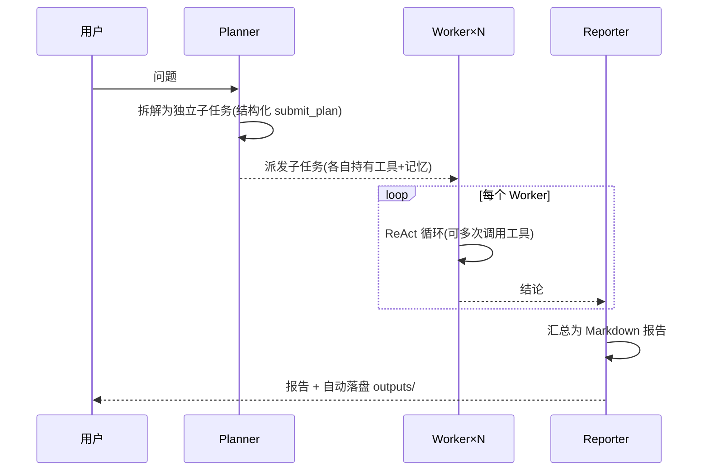

# 🧩 PocketAgent

**面试展示级的多智能体（AI Agent）项目** —— 自研 ReAct 工具调用循环 + Planner / Worker / Reporter 团队编排，开箱即跑：**零第三方依赖的核心、无 API Key 也能完整演示、单元测试齐全、带 Gradio 图形界面**，兼容 DeepSeek / OpenAI / Ollama 等任意 OpenAI 格式的模型服务。

> 面向"Agent 工程师 / LLM 应用开发"岗位的面试项目：代码量精炼（约 1500 行），
> 每个模块都可独立讲解；不依赖 LangChain / AutoGen 等框架，能充分体现你的工程能力。


## 🚀 快速开始

要求：Python 3.9+（推荐 3.10+），无需 GPU。

### 第一步：零依赖离线跑通（无需安装任何第三方库、无需 API Key）

```bash
cd D:\Workspace\agent            # 你的项目目录
python examples/demo_mock.py
```

你会看到单 Agent 完成"计算 → 调用工具 → 回复"，以及多智能体团队自动拆解任务、并行执行、生成 Markdown 报告：

```text
========================================================
第 2 部分 · 多智能体研究团队（Planner → Workers → 报告）
========================================================
[提示] 团队「研究团队」开始处理问题

[规划] 拆解为 3 个子任务：
  · 计算表达式 21*2：请计算并说明结果：21*2
  · 计算表达式 100/4：请计算并说明结果：100/4
  · 获取当前时间：请通过工具获取当前日期与时间，并说明今天是星期几。
[Worker worker-1] 开始执行...
[Worker worker-2] 开始执行...
[Worker worker-3] 开始执行...
[提示] 报告已保存：outputs\research_xxxxxxxx.md
全部跑通 ✅
```

### 第二步：运行单元测试（仅标准库）

```bash
python -m unittest discover -s tests -t . -v
# 预期：Ran 31 tests ... OK
# 若装有 pytest：python -m pytest -q 亦可
```

### 第三步：启动图形界面

```bash
pip install -r requirements.txt     # 仅 Gradio 一个第三方依赖（可选）
python -m pocketagent.gui           # 浏览器访问 http://127.0.0.1:7860
```

界面默认 **Mock 离线模式**即可对话；也可在下拉框切换 DeepSeek / OpenAI / Ollama。

### 第四步：接入真实模型（选一种）

```bash
copy .env.example .env              # 然后编辑 .env 填入你的 Key
python -m pocketagent chat          # 交互式聊天
python -m pocketagent research "对比 Python 与 Go 的优缺点并给出选型建议"
python -m pocketagent doctor        # 环境自检（检查配置是否就绪）
```

支持的模型服务（均走 OpenAI 兼容协议，**无需修改代码**）：

| 服务 | AGENT_BASE_URL | AGENT_MODEL | 备注 |
| --- | --- | --- | --- |
| DeepSeek（默认） | `https://api.deepseek.com` | `deepseek-chat` | 便宜、中文好、支持 function calling |
| OpenAI | `https://api.openai.com/v1` | `gpt-4o-mini` | — |
| Ollama（本地免费） | `http://127.0.0.1:11434/v1` | `qwen2.5:7b` | `ollama pull qwen2.5:7b && ollama serve` |
| vLLM / 各类中转 | 你的服务地址 | 你的模型名 | 兼容即可 |

> 小贴士：命令行也支持 `--mock`：`python -m pocketagent chat --mock`；
> `--model / --base-url / --api-key` 可临时覆盖 .env 配置。

---

## 🏗️ 架构总览

```
┌──────────────────────────────────────────────────────────────┐
│                        PocketAgent                            │
│                                                               │
│  交互层   CLI (python -m pocketagent)    Gradio GUI           │
│           └──────────────┬───────────────────┘                │
│  编排层   AgentTeam: Planner → Workers(独立 Agent) → Reporter │
│           └──────────────┬───────────────────┘                │
│  单Agent  Agent 主循环（ReAct: 思考→工具→观察→回答）           │
│           └──────────────┬───────────────────┘                │
│  组件层   LLM(Base) 记忆(RollingMemory) 工具(Tool/Registry)   │
│           ┌──────────────┴───────────────┬───────────────────┐│
│  实现     OpenAICompatibleLLM  MockLLM    Calculator / Time   │
│           ToyLLM(离线规则大脑)            Wikipedia / FetchURL│
└──────────────────────────────────────────────────────────────┘
```

多智能体一次研究的时序：



### 目录结构

```text
agent/
├── README.md                # 本文件
├── requirements.txt         # 唯一第三方依赖：gradio(可选)
├── pyproject.toml           # 打包 / pip install -e .
├── .env.example             # 模型配置模板（复制为 .env 使用）
├── examples/
│   └── demo_mock.py         # 零依赖离线演示（推荐先跑它）
├── pocketagent/             # 核心包（仅标准库）
│   ├── models.py            #   Message / ToolCall 数据结构
│   ├── llm.py               #   LLM 抽象 + OpenAI 兼容 REST 客户端 + MockLLM
│   ├── toy.py               #   ToyLLM：离线规则大脑
│   ├── memory.py            #   滑动窗口记忆
│   ├── tools.py             #   工具抽象与注册表
│   ├── builtin_tools.py     #   安全计算器/时间/Wikipedia/网页抓取
│   ├── agent.py             #   ReAct 主循环（核心）
│   ├── team.py              #   多智能体编排（Planner→Workers→Reporter）
│   ├── cli.py / __main__.py #   命令行
│   └── gui.py               #   Gradio 界面
└── tests/                   # 31 个单元测试（unittest，零依赖）
```

---

## 🎯 设计亮点（面试讲解重点）

### 1. 自研 Agent 循环，而不是框架封装
`agent.py` 中 `Agent.run()` 只有几十行：把消息发给 LLM → 有 `tool_calls` 就执行工具、把结果以 `role="tool"` 回填 → 直到模型给出最终回答。没有黑魔法，可以逐行讲清楚。配套处理：**最大步数截断**、**未知工具 / 工具异常兜底**、**模型调用失败不崩溃**。

### 2. 结构化输出规避 JSON 解析脆弱性
规划器不"让模型吐 JSON 字符串再解析"，而是提供一个 `submit_plan` 内部工具让模型**以 function calling 提交结构化计划**；同时保留 content 直接解析作为降级路径。这是生产多智能体里很常见的细节坑。

### 3. 安全计算器：AST 白名单求值
用 `ast` 解析后只允许数字字面量 + 白名单运算符/函数，并限制指数、结果位数——**既不用 eval，也不用外部库**。`__import__('os')` 这类注入会被直接拒绝（有测试覆盖）。

### 4. 优雅降级，永不中断
- 网络失败 / 词条不存在 → 工具返回错误文本，让模型自行换个方式；
- Reporter 润色失败 → 自动退回"模板汇总"；
- 没 API Key → ToyLLM 仍可演示完整流程。

### 5. 零第三方依赖 + 可测试性
核心只用标准库（连 HTTP 都是 `urllib`），`MockLLM` 脚本化假模型让测试**离线、确定、免费**。31 个测试覆盖工具、记忆、REST 载荷、Agent 循环、多智能体全流程。

### 6. 事件流驱动展示
每一步都产出结构化事件（思考/工具调用/工具返回/最终回复），CLI 与 GUI 共用同一套 `render_event`，方便实时展示"Agent 在做什么"——面试演示的加分项。

### 常见追问自测
- **为什么不用 LangChain？** 答：本项目目标是展示对 Agent 底层原理的理解，核心循环约 150 行可讲清；真实工程可在此基础上引入框架/编排器。可对比说明 LangChain 解决的问题（模型抽象、工具生态、内存、Trace）与本项目的取舍。
- **多智能体并行怎么保证安全？** 答：Worker 之间只共享只读的工具注册表与 LLM 客户端，各自持有独立记忆；`parallel=True` 时用线程池并发，事件记录加锁。
- **如何扩展新工具？** 答：继承 `Tool`，声明 `name/description/parameters` 并实现 `run`，注册进 `ToolRegistry` 即可，模型会自动拿到 schema。
- **想接 MCP / RAG / 流式输出？** 见下方"后续规划"，README 也给出了演进思路。

---

## 🧪 测试

```bash
python -m unittest discover -s tests -t . -v
```

覆盖范围：计算器（含注入/资源耗尽防护）、时间工具、工具注册表、记忆裁剪、
REST 请求构造与响应解析（Mock 网络）、Agent 工具闭环/未知工具/异常/截断、
多智能体 Planner→Worker→Reporter→报告落盘。

---

## 🛣️ 后续规划（可向面试官展开的 roadmap）

- [ ] 流式输出（SSE）与半途停止
- [ ] 记忆升级：按 token 截断 + LLM 摘要压缩
- [ ] 接入 MCP（Model Context Protocol）作为统一工具协议
- [ ] 增加 RAG 工具（本地向量库 + 重排序）
- [ ] 结构化评测集：用脚本化场景回归 Agent 决策质量

---

## ❓ FAQ / 排错

| 现象 | 解决 |
| --- | --- |
| `python examples/demo_mock.py` 报找不到 pocketagent | 在**项目根目录**运行（脚本会自动把仓库根加入 sys.path） |
| 提示"缺少 API Key" | 复制 `.env.example` 为 `.env` 填写；或 `chat --mock`；或改用本地 Ollama |
| `chat --mock` 回答很傻 | 正常：ToyLLM 只是规则大脑，用于无 Key 演示流程；配 Key 后即真实模型 |
| Ollama 连不上 | 确认 `ollama serve` 已启动、模型已 `ollama pull`、base_url 端口为 11434 |
| 网页抓取 / Wikipedia 失败 | 检查网络；Wikipedia 工具需 `pip install wikipedia`（可选） |
| 想在本机一键安装 | `pip install -e .`（pyproject.toml 已就绪） |

---


建议：把本目录改名为 `pocket-agent` 之类有辨识度的仓库名；`.env` 已在 `.gitignore` 中，**切勿提交真实 Key**。

---

## 📄 License

[MIT](./LICENSE) © 2026 PocketAgent Contributors

**Made for learning & interviews** —— 欢迎 Star / Fork / 提 Issue。
